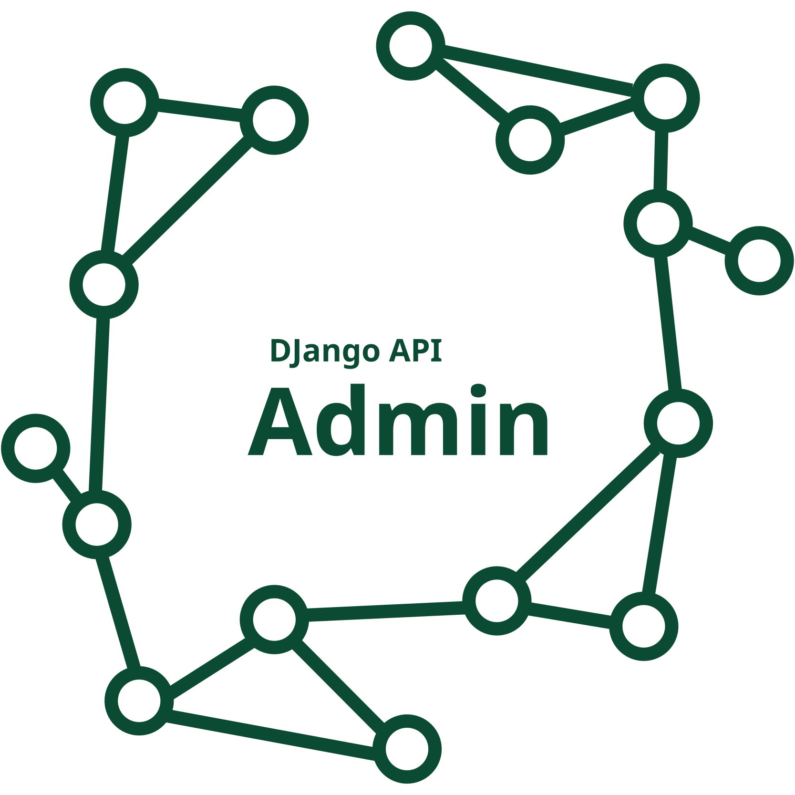

<a id="readme-top"></a>


<!-- PROJECT SHIELDS -->
[![Contributors][contributors-shield]][contributors-url]
[![Forks][forks-shield]][forks-url]
[![Stargazers][stars-shield]][stars-url]
[![Issues][issues-shield]][issues-url]
[![Unlicense License][license-shield]][license-url]
[![LinkedIn][linkedin-shield]][linkedin-url]


<!-- PROJECT LOGO -->
<br />
<div align="center">
  <a href="https://github.com/demon-bixia/django-api-admin">
    
  </a>

  <h3 align="center">Django API Admin</h3>

  <p align="center">
    A RESTful API implementation of django.contrib.admin, designed for writing custom frontends.
    <br />
    <!-- <a href="https://github.com/othneildrew/Best-README-Template"><strong>Explore the docs »</strong></a> -->
    <!-- <br /> -->
    <!-- <br /> -->
    <!-- <a href="https://github.com/othneildrew/Best-README-Template">View Demo</a>
    &middot; -->
    <a href="https://github.com/othneildrew/Best-README-Template/issues/new?labels=bug&template=bug-report---.md">Report Bug</a>
    &middot;
    <a href="https://github.com/othneildrew/Best-README-Template/issues/new?labels=enhancement&template=feature-request---.md">Request Feature</a>
  </p>
</div>


<!-- TABLE OF CONTENTS -->
<details>
  <summary>Table of Contents</summary>
  <ol>
    <li>
      <a href="#about-the-project">About The Project</a>
      <ul>
        <li><a href="#built-with">Built With</a></li>
      </ul>
    </li>
    <li>
      <a href="#getting-started">Getting Started</a>
      <ul>
        <li><a href="#prerequisites">Prerequisites</a></li>
        <li><a href="#installation">Installation</a></li>
      </ul>
    </li>
    <li><a href="#usage">Usage</a></li>
    <li><a href="#roadmap">Roadmap</a></li>
    <li><a href="#contributing">Contributing</a></li>
    <li><a href="#license">License</a></li>
    <li><a href="#contact">Contact</a></li>
    <li><a href="#acknowledgments">Acknowledgments</a></li>
  </ol>
</details>


<!-- ABOUT THE PROJECT -->
## About The Project

[![Product Name Screen Shot][product-screenshot]](https://example.com)

The Django API Admin project is a RESTful API implementation of the `django.contrib.admin` module, designed to facilitate the creation of custom frontends. This project aims to provide developers with a robust and flexible API that mirrors the functionality of Django's built-in admin interface, allowing for seamless integration with modern web applications.

### Key Features:
- **RESTful API**: Offers a comprehensive API for managing Django models, enabling developers to build custom administrative interfaces.
- **Custom Frontends**: Designed to support the development of tailored frontends that meet specific project requirements.
- **Extensible and Modular**: Build with the same django.contrib.admin API, allowing for easy customization and integration with existing Django projects.

The project is continuously evolving, with new features and improvements being added regularly. Contributions from the community are highly encouraged to help expand and enhance the capabilities of this tool.

To get started, follow the installation and usage instructions provided in this README. Whether you're building a new project or integrating with an existing one, Django API Admin offers the flexibility and power you need to manage your application's data effectively.


<p align="right">(<a href="#readme-top">back to top</a>)</p>


### Built With

This section should list any major frameworks/libraries used to bootstrap your project. Leave any add-ons/plugins for the acknowledgements section. Here are a few examples.

* [![Django][Django]][Django-url]
* [![DRF][Django REST framework]][DRF-url]

<p align="right">(<a href="#readme-top">back to top</a>)</p>


<!-- GETTING STARTED -->
## Getting Started

To set up the project locally, follow these steps:

### Prerequisites

Before you begin, ensure you have met the following requirements:

- **Python 3.8+**: Make sure Python is installed on your machine. You can download it from [python.org](https://www.python.org/downloads/).

- **pip**: Ensure you have pip installed for managing Python packages. It usually comes with Python installations.

- **Virtual Environment**: It's recommended to use a virtual environment to manage dependencies. You can create one using `venv` or `virtualenv`.

- **rest_framework**
  ```sh
  pip install djangorestframework
  ```
- **drf-spectacular**
  ```sh
  pip install drf-spectacular
  ```
- **djangorestframework-simplejwt**
  ```sh
  pip install djangorestframework-simplejwt
  ```
- **django-cors-headers**
  ```sh
  pip install django-cors-headers
  ```

### Installation

This guide will walk you through the steps to integrate `django-api-admin` into your Django project. Follow these instructions to get started.

1. **Install the Package**
   ```sh
   pip install django-api-admin
   ```
2. **Add to Installed Apps** Add django_api_admin and it's requirements to the INSTALLED_APPS list in your Django project's settings.py file (the order doesn't matter):
   ```py
   # settings.py
   INSTALLED_APPS = [
      'corsheaders',
      'drf_spectacular',
      'rest_framework',
      'django_api_admin'
   ]
   ```
3. In your Django settings file, add or update the `REST_FRAMEWORK` dictionary to include the drf spectacular as the DEFAULT_SCHEMA_CLASS:  
   ```py
   # settings.py
   REST_FRAMEWORK = {
       'DEFAULT_SCHEMA_CLASS': 'drf_spectacular.openapi.AutoSchema',
   }
   ```
4. Add the urls of your client side applications to the `CORS_ORIGIN_WHITELIST`
   ```py
   # settings.py
   CORS_ORIGIN_WHITELIST = (
       'http://localhost',  # jest-dom test server
       'http://localhost:3000',  # react developement server
   )
   CORS_ALLOW_CREDENTIALS = True
   ```

Thats it you are now ready to register your models and implement your django admin frontend!

<p align="right">(<a href="#readme-top">back to top</a>)</p>


<!-- USAGE EXAMPLES -->
## Usage

This section provides a simple example on how to use django-api-admin. If you're setting up for the first time, follow the example below to get started.

1. **Create some models**
   ```py
   # models.py
   from django.db import models
 
   class Author(models.Model):
       name = models.CharField(max_length=100)
 
       def __str__(self):
           return self.name
 
   class Book(models.Model):
       title = models.CharField(max_length=100)
       author = models.ForeignKey(Author, on_delete=models.CASCADE)
 
       def __str__(self):
           return self.title
   ```
2. **Register them using the admin site**
   ```py
   # admin.py
   from django_api_admin.sites import site
   from .models import Author, Book

   site.register(Author)
   site.register(Book)
   ```
3. **Include URLs** Include the django-api-admin URLs in your  
   ```py
   # urls.py
   from django.urls import path
   from django_api_admin.sites import site

   urlpatterns = [
      path('api_admin/', site.urls),
   ]
   ```


<!-- _For more examples, please refer to the [Documentation](https://example.com)_ -->

<p align="right">(<a href="#readme-top">back to top</a>)</p>


<!-- ROADMAP -->
## Roadmap

- [x] Rewrite django.contrib.admin as an API
- [x] Add support for Bulk Actions
- [x] Add OpenAPI documentation
- [ ] Add a customizable dashboard
- [ ] Oauth support
- [ ] Multi-language Support
    - [ ] Arabic
    - [ ] Spanish

See the [open issues](https://github.com/demon-bixia/django-api-admin/issues) for a full list of proposed features (and known issues).

<p align="right">(<a href="#readme-top">back to top</a>)</p>


<!-- CONTRIBUTING -->
## Contributing

Contributions are what make the open source community such an amazing place to learn, inspire, and create. Any contributions you make are **greatly appreciated**.

If you have a suggestion that would make this better, please fork the repo and create a pull request. You can also simply open an issue with the tag "enhancement".
Don't forget to give the project a star! Thanks again!

1. Fork the Project
2. Create your Feature Branch (`git checkout -b feature/AmazingFeature`)
3. Commit your Changes (`git commit -m 'Add some AmazingFeature'`)
4. Push to the Branch (`git push origin feature/AmazingFeature`)
5. Open a Pull Request

### Top Contributors

<a href="https://github.com/demon-bixia/django-api-admin/graphs/contributors">
  
</a>

<p align="right">(<a href="#readme-top">back to top</a>)</p>


<!-- LICENSE -->
## License

Distributed under the MIT License. See the `LICENSE` file  for more information.

<p align="right">(<a href="#readme-top">back to top</a>)</p>


<!-- CONTACT -->
## Contact

Muhammad Salah - [@demobixia](https://t.me/demonbixia) - msbizzaccount@outlook.com

Project Link: [https://github.com/demon-bixia/django-api-admin](https://github.com/demon-bixia/django-api-admin)

<p align="right">(<a href="#readme-top">back to top</a>)</p>


<!-- ACKNOWLEDGMENTS -->
## Acknowledgments

This section is dedicated to recognizing the valuable resources and contributions that have supported this project. Below are some of the key references and inspirations that have been instrumental in the project's development journey.

* [Django Web Framework](https://www.djangoproject.com/)
* [Django Rest Framework](https://www.django-rest-framework.org/)
* [Simple JWT](https://github.com/jazzband/djangorestframework-simplejwt/tree/master)
* [Django Cors Headers](https://github.com/adamchainz/django-cors-headers)
* [DRF Spectacular](https://github.com/tfranzel/drf-spectacular)
* [Best README Template](https://github.com/othneildrew/Best-README-Template)
* [QODO AI](https://www.qodo.ai/)

<p align="right">(<a href="#readme-top">back to top</a>)</p>


<!-- MARKDOWN LINKS & IMAGES -->
<!-- https://www.markdownguide.org/basic-syntax/#reference-style-links -->
[contributors-shield]: https://img.shields.io/github/contributors/othneildrew/Best-README-Template.svg?style=for-the-badge
[contributors-url]: https://github.com/demon-bixia/django-api-admin/graphs/contributors

[forks-shield]: https://img.shields.io/github/forks/demon-bixia/django-api-admin.svg?style=for-the-badge
[forks-url]: https://github.com/demon-bixia/django-api-admin/network/members

[stars-shield]: https://img.shields.io/github/stars/demon-bixia/django-api-admin.svg?style=for-the-badge
[stars-url]: https://github.com/demon-bixia/django-api-admin/stargazers

[issues-shield]: https://img.shields.io/github/issues/demon-bixia/django-api-admin?style=for-the-badge
[issues-url]: https://github.com/demon-bixia/django-api-admin/issues

[license-shield]: https://img.shields.io/badge/license-MIT-blue?style=for-the-badge
[license-url]: https://github.com/demon-bixia/django-api-admin/blob/main/LICENSE

[linkedin-shield]: https://img.shields.io/badge/%40-Linkedin-blue?style=for-the-badge
[linkedin-url]: https://www.linkedin.com/in/demon-bixia/

[Django-url]: https://djangoproject.com/
[Django]: https://img.shields.io/badge/Django-092E20?style=for-the-badge&logo=django&logoColor=green

[DRF-url]: https://www.django-rest-framework.org/
[Django REST framework]: https://img.shields.io/badge/django--rest--framework-3.12.4-green?style=for-the-badge&labelColor=333333&logo=django&logoColor=white&color=green

[product-screenshot]: assets/images/screenshot.png
