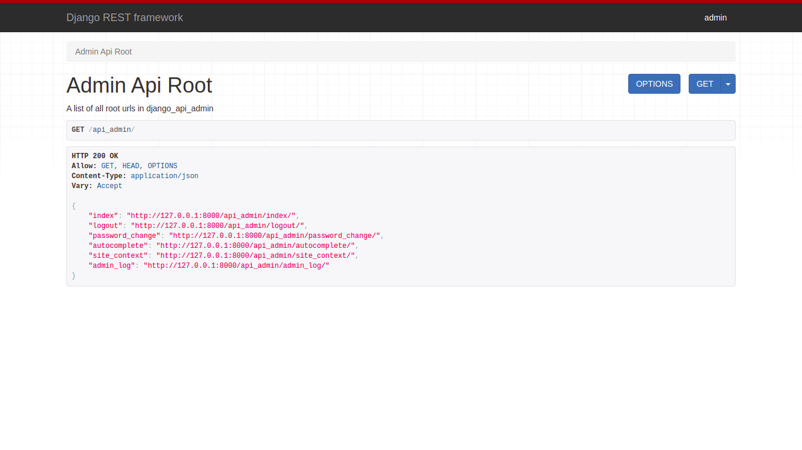

Expose django.contrib.admin as a restful service. useful for adding new features to django admin or writing a new admin.

## Features ⚡

- [x] Expose all django.contrib.admin views as a restful api.
- [x] Similar to django.contrib.admin.
- [x] Customizable AdminSite and ModelAdmin.
- [x] Supports InlineModelAdmins and bulk edits.
- [x] Provides data to dynamically create forms on clients from serializers.
- [x] Extensively tested


## Requirements 📄

<p>Python 3.9+</p>
<p>This package depends on</p>
<ul>
    <li><a href="https://github.com/encode/django-rest-framework">django-rest-framework</a></li>
    <li>django.contrib.admin</li>
</ul>

## Installation 📲

<p>Install django-api-admin package.</p>

```bash
$ pip install django-api-admin
```

<p>In your settings.py make sure you have <i>django.contrib.admin</i> and <i>rest_framework</i> in your installed apps. and add <i>django_api_admin</i>.</p>

```python
INSTALLED_APPS = [
    'django.contrib.admin',
    'rest_framework',
    'django_api_admin',
]
```

## Example 💡

<p>1. create some models.</p>

<b>models.py</b>

```python
from django.db import models


class Author(models.Model):
    name = models.CharField(max_length=100)

    def __str__(self):
        return self.name


class Book(models.Model):
    title = models.CharField(max_length=100)
    author = models.ForeignKey(Author, on_delete=models.CASCADE)

    def __str__(self):
        return self.title
```

<p>2. register them using the admin site.</p>

<b>admin.py</b>

```python
from django_api_admin.sites import site
from .models import Author, Book

site.register(Author)
site.register(Book)
```

<p>3. include admin urls.</p>

<b>urls.py</b>

```python
from django_api_admin.sites import site

urlpatterns = [
    path('api_admin/', site.urls),
]
```

<p>4. run your development server.</p>

```bash
$ python manage.py runsever
```

visit your <a href="http://127.0.0.1:8000/api_admin">localhost</a> to see the browsable api.

## Screenshots 🖼


